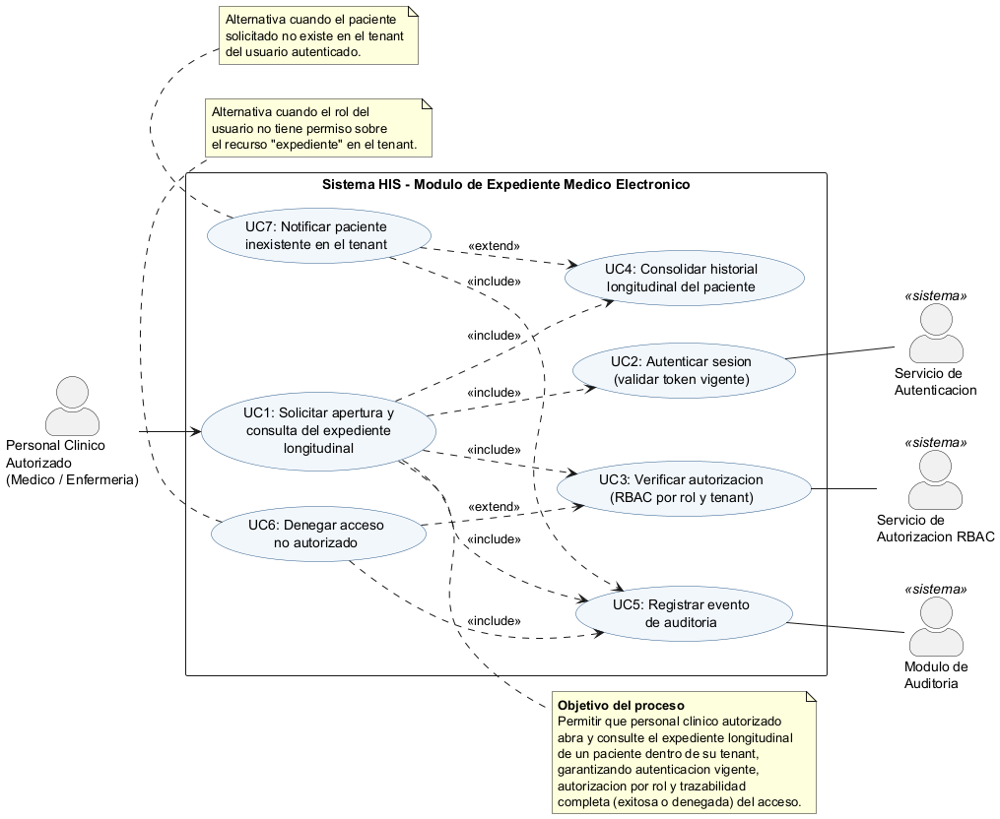
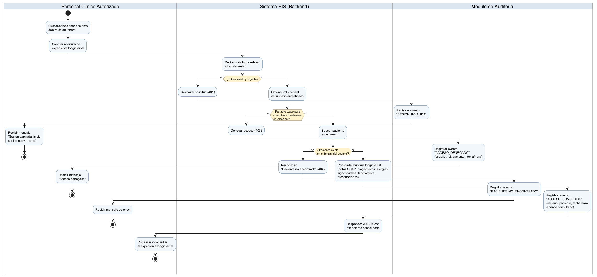
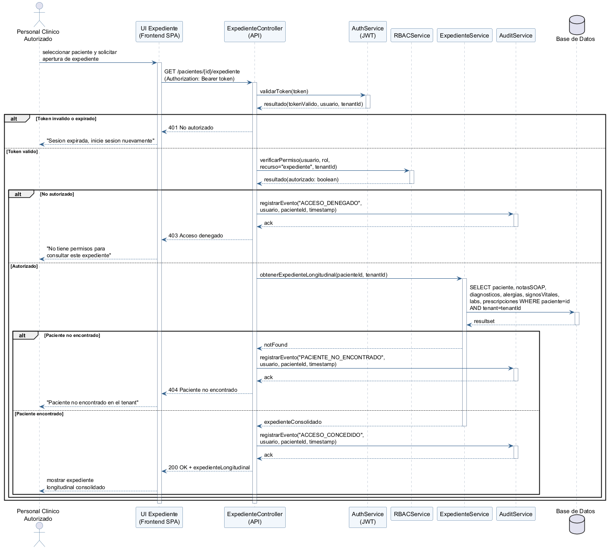

# Portada

| Campo | Dato |
|---|---|
| Estudiante | Maryori Rachael Fajardo Paredes |
| Usuario GitHub | `maryorifajardo14` |
| Módulo oficial | Expediente médico electrónico base |
| Alcance de la actividad | Expediente médico electrónico base |
| Proceso modelado | Apertura y consulta autorizada del expediente longitudinal |
| Repositorio (URL) | `PENDIENTE: completar con la URL del remoto en GitHub tras el push` |
| Rama evaluada | `main` |
| Commit / etiqueta evaluada | `PENDIENTE: completar con el hash del commit final (ver docs/EVIDENCIA_GIT.md)` |
| Fecha de entrega | 05 de agosto de 2026 |

> **Nota:** los campos marcados como *PENDIENTE* deben completarse una vez creado el repositorio remoto
> compartido con el docente y realizado el commit final, siguiendo `docs/EVIDENCIA_GIT.md`.

---

# Índice

1. [Introducción](#introducción)
2. [Desarrollo](#desarrollo)
   1. [Contexto del módulo y delimitación del proceso](#1-contexto-del-módulo-y-delimitación-del-proceso)
   2. [Requisitos y reglas de negocio](#2-requisitos-y-reglas-de-negocio)
   3. [Diagrama de casos de uso](#3-diagrama-de-casos-de-uso)
   4. [Diagrama de actividad](#4-diagrama-de-actividad)
   5. [Diagrama de secuencia](#5-diagrama-de-secuencia)
   6. [Matriz de trazabilidad](#6-matriz-de-trazabilidad)
   7. [Evidencia de ejecución y validación de los diagramas](#7-evidencia-de-ejecución-y-validación-de-los-diagramas)
   8. [Evidencia Git](#8-evidencia-git)
   9. [Uso de inteligencia artificial](#9-uso-de-inteligencia-artificial)
3. [Conclusión](#conclusión)
4. [Bibliografía](#bibliografía)

---

# Introducción

El presente documento desarrolla el análisis UML del proceso de negocio **"apertura y consulta autorizada
del expediente longitudinal"**, correspondiente al módulo **Expediente médico electrónico base** dentro de
un sistema de información hospitalario (HIS) multi-tenant. El objetivo es modelar, con datos exclusivamente
ficticios, cómo el personal clínico autorizado accede al historial consolidado de un paciente garantizando
tres propiedades no negociables en un sistema clínico: **autenticación vigente**, **autorización por rol y
tenant (RBAC)** y **trazabilidad completa del acceso**, sea este concedido o denegado.

Se presentan tres diagramas UML complementarios —casos de uso, actividad y secuencia— construidos de forma
que comparten los mismos actores, el mismo orden de validaciones y las mismas excepciones, de manera que un
lector pueda seguir el proceso desde la intención del usuario (qué quiere lograr) hasta el intercambio de
mensajes entre componentes de software (cómo se logra). Se acompaña una matriz de trazabilidad que conecta
cada requisito funcional con el elemento concreto que lo representa en cada diagrama, y evidencia de que los
diagramas fueron efectivamente ejecutados/validados con una herramienta UML (PlantUML), además de la
evidencia Git del trabajo individual.

---

# Desarrollo

## 1. Contexto del módulo y delimitación del proceso

El módulo **Expediente médico electrónico base** administra el historial longitudinal de cada paciente
dentro de su tenant (institución/sede), consolidando información proveniente de otros módulos del HIS: notas
clínicas SOAP, diagnósticos, alergias, signos vitales, resultados de laboratorio y prescripciones. El proceso
modelado en esta actividad se limita estrictamente a:

- **Incluye:** solicitud de apertura del expediente, validación de sesión, verificación de autorización
  RBAC por tenant, verificación de existencia del paciente, consolidación de la vista longitudinal, registro
  de auditoría y respuesta al usuario (éxito o error).
- **No incluye** (por pertenecer a otros módulos de la asignación grupal): la captura/edición de notas SOAP
  (módulo de Joshua García), el registro de alergias y su alerta visual (módulo de Axel Herrera), la captura
  de signos vitales (módulo de Josué Hicho) ni el motor de RBAC en sí mismo (módulo de Luis Aroche). Estos se
  referencian únicamente como colaboradores externos al proceso, consistente con la separación de
  responsabilidades del proyecto grupal.

## 2. Requisitos y reglas de negocio

| ID | Requisito funcional |
|---|---|
| RF-01 | El personal clínico autorizado debe poder solicitar la apertura del expediente longitudinal de un paciente de su propio tenant. |
| RF-02 | El sistema debe validar que la sesión (token) esté vigente antes de procesar cualquier solicitud. |
| RF-03 | Si la sesión no es válida, el sistema debe rechazar la solicitud (401) y dejar constancia del intento. |
| RF-04 | El sistema debe verificar, mediante RBAC, que el rol del usuario tenga permiso para consultar expedientes en su tenant. |
| RF-05 | Si el rol no está autorizado, el sistema debe denegar el acceso (403) de forma trazable. |
| RF-06 | El sistema debe verificar que el paciente solicitado exista dentro del tenant del usuario autenticado. |
| RF-07 | Si el paciente no existe en el tenant, el sistema debe notificarlo (404) de forma trazable. |
| RF-08 | El sistema debe consolidar el historial longitudinal (notas SOAP, diagnósticos, alergias, signos vitales, laboratorios, prescripciones) del paciente autorizado. |
| RF-09 | Todo acceso —concedido o denegado— debe registrarse en la bitácora de auditoría con usuario, paciente y fecha/hora. |
| RF-10 | El sistema debe responder con el expediente consolidado (200) o con el motivo de error correspondiente (401/403/404). |

**Reglas de negocio clave:**

- El orden de validación es **sesión → autorización de rol → existencia del paciente**, para evitar que un
  usuario sin permiso pueda inferir (por diferencia entre 403 y 404) si un paciente existe en un tenant al
  que no tiene acceso.
- Todo intento de acceso —exitoso, denegado por rol o fallido por paciente inexistente— genera un evento de
  auditoría inmutable; no existen caminos de salida sin registro.
- El expediente longitudinal solo puede consultarse dentro del tenant del usuario autenticado (aislamiento
  multi-tenant).

## 3. Diagrama de casos de uso

**Objetivo del proceso:** permitir que personal clínico autorizado abra y consulte el expediente longitudinal
de un paciente dentro de su tenant, garantizando autenticación vigente, autorización por rol y trazabilidad
completa (exitosa o denegada) del acceso.

**Actor primario:** Personal Clínico Autorizado (Médico / Enfermería).
**Actores de soporte (sistemas colaboradores):** Servicio de Autenticación, Servicio de Autorización RBAC,
Módulo de Auditoría.

*Fuente editable:* [`diagramas/caso_uso.puml`](../diagramas/caso_uso.puml)

El caso de uso base **UC1: Solicitar apertura y consulta del expediente longitudinal** incluye
(`<<include>>`) los casos de uso UC2 (autenticar sesión), UC3 (verificar autorización RBAC), UC4 (consolidar
historial) y UC5 (registrar auditoría), que siempre ocurren como parte del proceso. Las alternativas de
excepción **UC6: Denegar acceso no autorizado** y **UC7: Notificar paciente inexistente** extienden
(`<<extend>>`) a UC3 y UC4 respectivamente, y ambas incluyen a UC5 para dejar registrado el intento fallido.

## 4. Diagrama de actividad

El flujo de actividad mantiene el mismo orden de validaciones que el caso de uso (sesión → rol → existencia
del paciente) y usa tres carriles (*swimlanes*): **Personal Clínico Autorizado**, **Sistema HIS (Backend)** y
**Módulo de Auditoría**. Contiene tres decisiones y tres caminos de excepción, todos con un resultado final
explícito.

*Fuente editable:* [`diagramas/actividad.puml`](../diagramas/actividad.puml)

**Decisiones y excepciones modeladas:**

1. **¿Token válido y vigente?** → *no*: rechazo 401, se registra `SESION_INVALIDA` y el usuario recibe el
   mensaje de sesión expirada (fin del flujo).
2. **¿Rol autorizado para consultar expedientes en el tenant?** → *no*: denegación 403, se registra
   `ACCESO_DENEGADO` y el usuario recibe el mensaje de acceso denegado (fin del flujo).
3. **¿Paciente existe en el tenant del usuario?** → *no*: respuesta 404, se registra
   `PACIENTE_NO_ENCONTRADO` y el usuario recibe el mensaje de error (fin del flujo).

Cuando las tres condiciones se cumplen, el sistema consolida el historial longitudinal, registra
`ACCESO_CONCEDIDO` y responde 200 OK; el personal clínico visualiza el expediente (resultado exitoso).

## 5. Diagrama de secuencia

Participantes: `Medico` (actor), `UI Expediente (Frontend SPA)`, `ExpedienteController (API)`,
`AuthService (JWT)`, `RBACService`, `ExpedienteService`, `AuditService` y `Base de Datos`. El diagrama usa
tres bloques `alt` anidados que corresponden exactamente a las tres decisiones del diagrama de actividad y a
las extensiones UC6/UC7 del diagrama de casos de uso.

*Fuente editable:* [`diagramas/secuencia.puml`](../diagramas/secuencia.puml)

**Validaciones representadas como mensajes:**

- `API -> Auth : validarToken(token)` — corresponde a RF-02/RF-03.
- `API -> RBAC : verificarPermiso(usuario, rol, recurso="expediente", tenantId)` — corresponde a RF-04/RF-05.
- `Svc -> DB : SELECT ... WHERE paciente=id AND tenant=tenantId` — corresponde a RF-06/RF-07.
- `API -> Audit : registrarEvento(tipo, usuario, pacienteId, timestamp)` — se repite en las cuatro salidas
  posibles del proceso, corresponde a RF-09.
- Respuestas finales `200 OK`, `401`, `403` y `404` — corresponden a RF-10.

## 6. Matriz de trazabilidad

La matriz completa se encuentra en [`docs/matriz_trazabilidad.md`](matriz_trazabilidad.md) y conecta cada uno
de los diez requisitos funcionales (RF-01 a RF-10) con el elemento específico que lo representa en cada uno
de los tres diagramas, además de una tabla de consistencia de actores entre diagramas.

## 7. Evidencia de ejecución y validación de los diagramas

Los tres diagramas fueron generados a partir de sus fuentes `.puml` mediante **PlantUML 1.2024.7** sobre
**Java 21 (Temurin/Oracle)**, usando Graphviz `dot` 2.44.1 para el layout del diagrama de casos de uso. La
ejecución no reportó errores de sintaxis y produjo los tres archivos PNG incluidos en
[`diagramas/exportados/`](../diagramas/exportados/). El registro completo de la ejecución (log de compilación
de PlantUML) se conserva en [`docs/EVIDENCIA_EJECUCION.md`](EVIDENCIA_EJECUCION.md).

## 8. Evidencia Git

El historial de commits, el árbol de archivos del repositorio y el enlace al commit evaluado se documentan en
[`docs/EVIDENCIA_GIT.md`](EVIDENCIA_GIT.md), generado con `git log --oneline` tras finalizar el trabajo.

## 9. Uso de inteligencia artificial

Se utilizó Claude Code (Anthropic) como asistente durante la elaboración de este entregable. El detalle
completo —herramienta, propósito, prompts relevantes, partes aceptadas o modificadas y la validación humana
realizada— se declara de forma transparente en [`DECLARACION_IA.md`](../DECLARACION_IA.md), ubicado en la
raíz del repositorio.

---

# Conclusión

Se logró modelar de forma coherente y trazable el proceso "apertura y consulta autorizada del expediente
longitudinal" en tres perspectivas UML complementarias: qué puede hacer el actor y con qué colaboradores
(casos de uso), cómo fluye el proceso de negocio con sus decisiones y excepciones (actividad), y cómo se
concreta ese flujo en mensajes entre componentes de software con sus validaciones y respuestas (secuencia).
La decisión más relevante del diseño fue fijar el **orden de las validaciones** —sesión, luego autorización
por rol, y solo después existencia del paciente— porque invertir ese orden permitiría que un usuario sin
permiso distinga, por el código de error recibido (403 frente a 404), si un paciente existe en un tenant al
que no debería tener visibilidad; ese mismo orden se mantuvo idéntico en los tres diagramas para preservar la
trazabilidad exigida por la consigna. Una limitación que permanece es que el modelo no profundiza en el
contenido interno de cada dominio consolidado (SOAP, alergias, signos vitales, laboratorio), ya que estos se
tratan como cajas negras provistas por otros módulos del proyecto grupal, conforme a la delimitación de
alcance declarada en la sección 1; una extensión futura podría modelar el caso donde el historial se recupera
parcialmente si alguno de esos subsistemas no responde. El cumplimiento de los requisitos declarados se
sustenta en la matriz de trazabilidad (sección 6, con detalle en `docs/matriz_trazabilidad.md`), que enlaza
cada uno de los diez requisitos funcionales con un elemento verificable en cada diagrama, y en la evidencia de
ejecución (sección 7) que confirma que las tres fuentes UML compilan y renderizan sin errores.

---

# Bibliografía

- Object Management Group. *Unified Modeling Language (UML), versión 2.5.1*. OMG, 2017.
  https://www.omg.org/spec/UML/2.5.1/
- Documentación oficial de PHP. "Supported Versions" y manual de PDO.
  https://www.php.net/docs.php
- PlantUML. *PlantUML Language Reference Guide*. https://plantuml.com/
