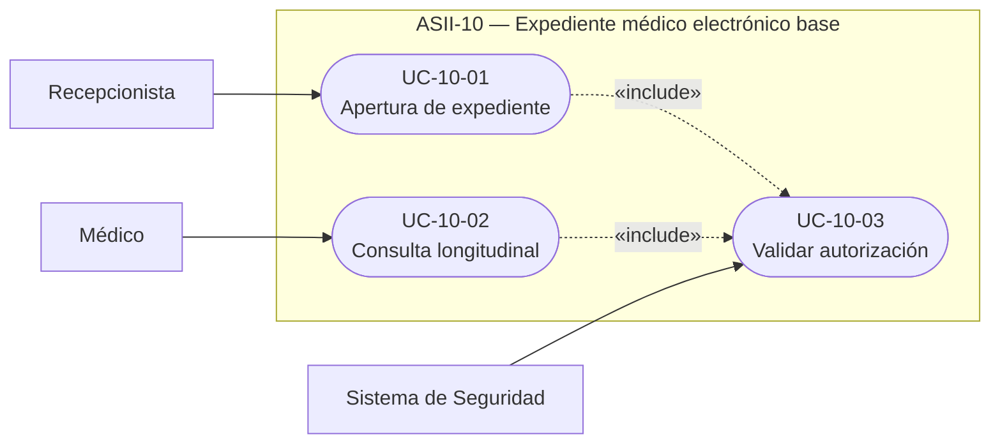
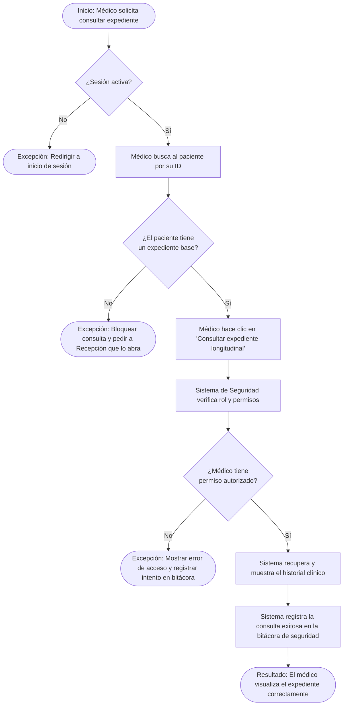
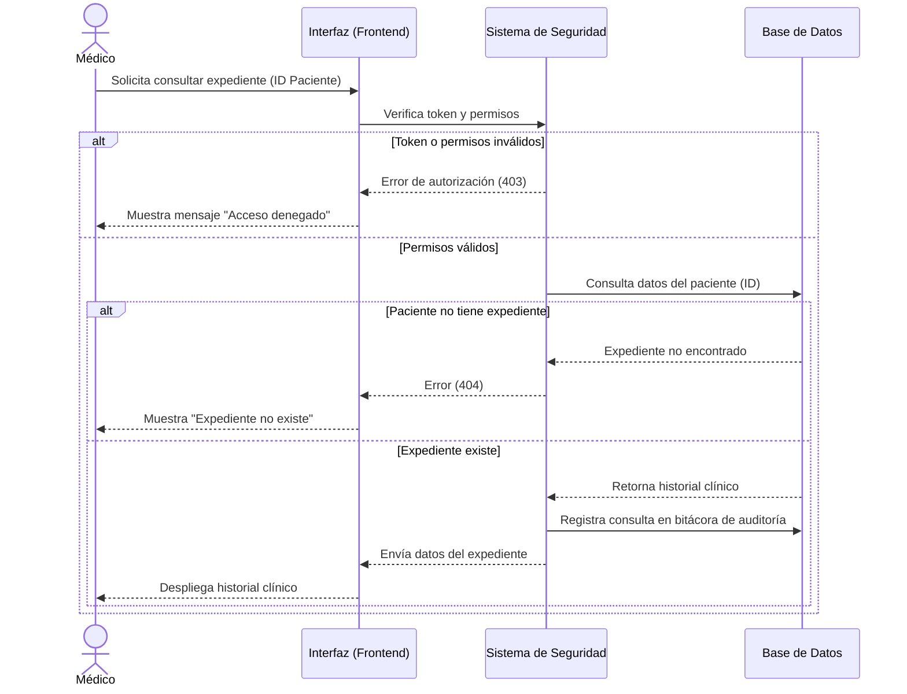

# ASII-10 — Expediente médico electrónico base
## Semana 1: diagnóstico, actores y casos de uso

> **Entrega correspondiente a la Semana 1** del plan ASII (ver `README.md` raíz, tabla "Plan semanal ASII", fila 1, y `docs/weekly-plan.md`): *"Identificar actores, procesos, límites y casos de uso del módulo dentro del HIS"*, con evidencia *"Diagrama UML de casos de uso + narrativa breve del alcance"*. Las secciones 1 a 5 cubren ese requisito. Las secciones 6 en adelante son material de apoyo adicional, adelantado para las semanas siguientes (procesos detallados, excepciones, reglas de dominio).

## 1. Objetivo

Delimitar el comportamiento de la apertura y consulta autorizada del expediente longitudinal dentro del Sistema Hospitalario Integrado (HIS), identificando a sus actores y documentando cómo se validan los permisos de acceso. Esta entrega es exclusivamente de análisis y diseño.

## 2. Límite del módulo

**Incluido en ASII-10:**
* Apertura (creación) del expediente médico longitudinal de un paciente.
* Consulta del historial médico.
* Validación de autorización (permisos) para visualizar el expediente.

**Fuera de alcance:**
* Administración de usuarios, roles o tenants (Módulos ASII-01 y ASII-02).
* Registro, edición y búsqueda de pacientes (Módulo ASII-03): ASII-10 asume que el paciente ya existe y solo abre/consulta su expediente.
* Creación de citas médicas (Módulo ASII-05) u órdenes de laboratorio (Módulo ASII-16, que consume el expediente pero no lo administra).
* Contenido clínico especializado que se registra **dentro** del expediente pero es responsabilidad de otros módulos verticales: notas SOAP y diagnósticos (Módulo ASII-11), alergias clínicas (Módulo ASII-12), signos vitales (Módulo ASII-13) y prescripciones electrónicas (Módulo ASII-15).

ASII-10 entrega el **contenedor base** del expediente longitudinal (creación y consulta autorizada); los módulos anteriores se integran a él para poblar contenido clínico específico, pero no forman parte de esta entrega.

## 3. Actores

| Actor | Tipo | Responsabilidad respecto al expediente |
|---|---|---|
| **Médico** | Humano, principal | Realiza la consulta autorizada del historial médico del paciente. |
| **Recepcionista** | Humano | Se encarga de la "apertura" o creación inicial del expediente en el sistema. |
| **Sistema de Seguridad** | Sistema de soporte | Valida las credenciales y verifica que el médico realmente tenga permisos antes de permitir una operación. |

## 4. Procesos identificados

| Proceso | Disparador | Actor responsable | Resultado |
|---|---|---|---|
| Apertura de expediente | Paciente registrado sin expediente longitudinal previo | Recepcionista | Registro base del expediente creado y disponible para recibir historial clínico. |
| Consulta longitudinal | Médico necesita ver el historial de un paciente | Médico (con validación de Sistema de Seguridad) | Historial clínico desplegado, con bitácora de acceso registrada. |
| Validación de autorización | Cualquier intento de apertura o consulta del expediente | Sistema de Seguridad | Aprueba o deniega la operación según rol/permiso del solicitante. |

## 5. Diagrama UML de casos de uso y narrativa

### 5.1. Diagrama de Casos de Uso

### 5.2. Narrativa breve de los casos de uso

| Código | Caso de uso | Actor principal | Resultado esperado |
|---|---|---|---|
| UC-10-01 | Apertura de expediente | Recepcionista | Crea el registro inicial del expediente longitudinal de un paciente en el sistema. |
| UC-10-02 | Consulta longitudinal | Médico | Obtiene el historial médico del paciente tras validar que cuenta con los permisos necesarios. |
| UC-10-03 | Validar autorización | Sistema de Seguridad | Verifica las credenciales y rol del médico, permitiendo o denegando el acceso a la consulta del expediente. |

**Narrativa del alcance:** el módulo cubre únicamente dos entradas al expediente longitudinal: la recepcionista lo **abre** una sola vez por paciente (UC-10-01), y el médico lo **consulta** cuantas veces lo necesite (UC-10-02). Ambos casos de uso incluyen (`«include»`) obligatoriamente la validación de autorización (UC-10-03) a cargo del Sistema de Seguridad, que es quien decide si la operación procede o se rechaza. No se contempla edición ni eliminación del expediente base en esta entrega.

---

## Anexo — material de apoyo (adelanto de semanas siguientes)

Estas secciones no son parte de la evidencia obligatoria de la Semana 1; se dejan documentadas desde ahora porque ya se diseñaron junto con los casos de uso y sirven de base para las Semanas 2 (RF/RNF), 3 (vista arquitectónica) y 5 (contrato API).

### A.1. Diagrama de Actividad

### A.2. Diagrama de Secuencia

### A.3. Especificación del flujo principal

#### Apertura de expediente

**Precondiciones**
* El paciente ya se encuentra registrado en el sistema hospitalario.
* La recepcionista ha iniciado sesión con credenciales válidas.

**Flujo principal**
1. La recepcionista ingresa al módulo de expedientes médicos.
2. Busca al paciente utilizando su identificador (ej. número de documento).
3. Selecciona la opción para inicializar o abrir el expediente longitudinal del paciente.
4. El sistema valida que el paciente no tenga un expediente previo duplicado.
5. El sistema crea el registro base del expediente asociado a ese paciente.

**Postcondiciones**
* El paciente cuenta con un expediente longitudinal activo, listo para empezar a recibir historial clínico.

#### Consulta autorizada del expediente

**Precondiciones**
* El médico posee credenciales válidas y una sesión activa.
* El expediente longitudinal del paciente ya ha sido creado.
* El sistema cuenta con roles y permisos configurados.

**Flujo principal**
1. El médico ingresa al módulo de expedientes y busca a un paciente específico.
2. El médico hace clic en "Consultar expediente longitudinal".
3. El Sistema de Seguridad intercepta la solicitud antes de mostrar los datos.
4. El Sistema de Seguridad verifica el rol del médico, su identidad y sus permisos de acceso.
5. Al ser válida la autorización, el sistema aprueba la solicitud.
6. El sistema despliega en pantalla el historial clínico completo al médico.

**Postcondiciones**
* El médico visualiza exitosamente la información clínica del paciente.
* Queda un registro (bitácora/log) de seguridad indicando qué médico accedió a qué expediente y en qué momento.

### A.4. Flujos alternos y excepciones

| Condición / Error | Respuesta del Sistema |
|---|---|
| Paciente no registrado en el sistema | El sistema bloquea la apertura del expediente y solicita a la recepcionista que primero registre los datos demográficos del paciente. |
| Intento de duplicar expediente | Si la recepcionista intenta abrir un expediente para un paciente que ya tiene uno, el sistema muestra una advertencia y redirige al expediente existente. |
| Médico sin sesión activa o token inválido | El Sistema de Seguridad rechaza la petición inmediatamente y redirige a la pantalla de inicio de sesión. |
| Médico sin permisos para ver el expediente | El Sistema de Seguridad deniega el acceso y muestra un error de autorización. Queda registrado el intento fallido en la bitácora de seguridad. |

### A.5. Reglas de dominio identificadas

| Regla | Descripción |
|---|---|
| RN-10-01 | Un paciente solo puede tener un (1) único expediente médico longitudinal en todo el sistema. |
| RN-10-02 | Todo acceso de consulta a un expediente debe registrarse obligatoriamente en una bitácora indicando usuario, fecha, hora y paciente consultado. |
| RN-10-03 | Ningún usuario sin el rol o permiso explícito autorizado puede visualizar el historial clínico completo del expediente. |

### A.6. Matriz de trazabilidad

| Requisito de la consigna | Diagrama correspondiente | Elemento en el diagrama |
|---|---|---|
| Delimitar actores y objetivo | Diagrama de Casos de Uso | Actores: Recepcionista, Médico, Sistema de Seguridad. Nodos: UC-10-01, UC-10-02, UC-10-03. |
| Incluir decisiones, excepciones y resultado | Diagrama de Actividad | Decisiones: ¿Sesión activa?, ¿El paciente tiene expediente?, ¿Permiso autorizado?. Excepciones: Nodos de "Excepción". Resultado: Nodo final "Resultado". |
| Mostrar participantes, mensajes, validaciones y respuesta | Diagrama de Secuencia | Participantes: Médico, Interfaz, Seguridad, BD. Validaciones: Bloque "alt Token o permisos inválidos" y "alt Paciente no tiene expediente". |
