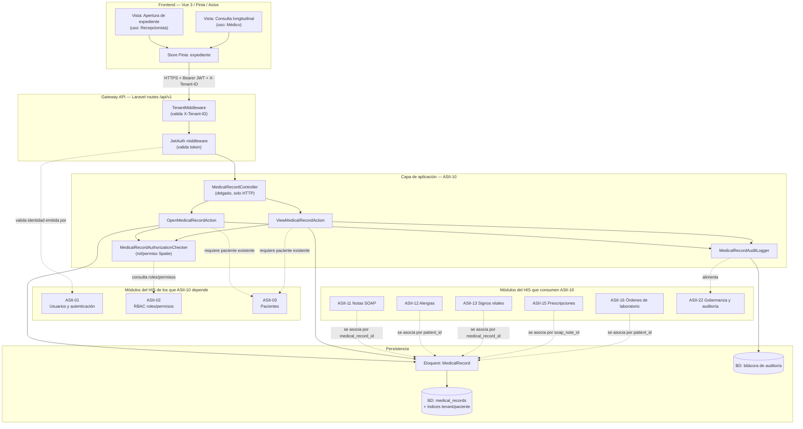

# ASII-10 — Expediente médico electrónico base
## Semana 3: vista arquitectónica del módulo

> **Entrega correspondiente a la Semana 3** del plan ASII (`README.md` raíz, tabla "Plan semanal ASII", fila 3, y `docs/weekly-plan.md`): *"Diseñar la vista arquitectónica del módulo y sus dependencias con el HIS"*, con evidencia *"Diagrama C4/UML o vista de componentes de alto nivel"*.
>
> Esta vista arquitectónica traduce a componentes el diseño de la [Semana 1](./semana-1-casos-de-uso.md) (actores y casos de uso) y de la [Semana 2](./semana-2-rf-rnf-solid.md) (RF/RNF y separación de responsabilidades bajo SRP). Se apoya en el stack real del repositorio: Laravel 12 + JWT + Spatie Permission + Stancl Tenancy en backend, Vue 3 + Pinia + Axios en frontend.

## 1. Vista de componentes de alto nivel

## 2. Descripción de los componentes propios de ASII-10

| Componente | Capa | Responsabilidad (ver SRP, Semana 2) |
|---|---|---|
| Vista "Apertura de expediente" / "Consulta longitudinal" | Frontend | UI mínima por rol (Recepcionista / Médico). |
| Store Pinia `expediente` | Frontend | Estado del expediente en cliente, llamadas Axios al gateway. |
| `MedicalRecordController` | API / aplicación | Recibe la petición HTTP, delega a la Action correspondiente. |
| `OpenMedicalRecordAction` | Aplicación | Orquesta la apertura: valida duplicado (RN-10-01) y crea el registro. |
| `ViewMedicalRecordAction` | Aplicación | Orquesta la consulta longitudinal y arma la respuesta. |
| `MedicalRecordAuthorizationChecker` | Dominio / seguridad | Rol del actor "Sistema de Seguridad" (UC-10-03): decide si la operación procede. |
| `MedicalRecordAuditLogger` | Dominio / auditoría | Registra cada intento (RF-10-06, RNF-10-04). |
| `MedicalRecord` (Eloquent) | Persistencia | Mapeo de la tabla `medical_records` (ya existente en el scaffold). |

## 3. Dependencias con el resto del HIS

**Módulos de los que ASII-10 depende (upstream):**

| Módulo | Dependencia |
|---|---|
| ASII-01 — Usuarios y autenticación | El JWT que valida `JwtAuth` middleware es emitido por este módulo; ASII-10 no gestiona login. |
| ASII-02 — RBAC | `MedicalRecordAuthorizationChecker` consulta roles/permisos administrados por RBAC (Spatie Laravel Permission), no los define. |
| ASII-03 — Pacientes | Toda apertura o consulta de expediente requiere que el paciente ya exista (`patient_id` es FK obligatoria en `medical_records`). |

**Módulos que dependen de ASII-10 (downstream / consumidores):**

| Módulo | Cómo se integra |
|---|---|
| ASII-11 — Notas SOAP | `soap_notes.medical_record_id` referencia el expediente creado por ASII-10. |
| ASII-12 — Alergias | Se muestran dentro de la consulta longitudinal del expediente, aunque su gestión es de ese módulo. |
| ASII-13 — Signos vitales | `vital_signs.medical_record_id` referencia el expediente; se listan en la vista longitudinal. |
| ASII-15 — Prescripciones | Cuelgan de una nota SOAP (`prescriptions.soap_note_id`), que a su vez cuelga del expediente. |
| ASII-16 — Órdenes de laboratorio | Se originan "desde EMR", es decir desde el expediente que abre/expone ASII-10. |
| ASII-22 — Gobernanza y auditoría | Consume los registros que produce `MedicalRecordAuditLogger` (RN-10-02) para la bitácora general del sistema. |

## 4. Vista transversal (cross-cutting)

`TenantMiddleware` y `JwtAuth` (ya implementados en `app/Http/Middleware/`) son transversales a **todos** los módulos clínicos, no solo a ASII-10: garantizan aislamiento multi-tenant (RNF de todos los módulos) y autenticación antes de llegar a cualquier controlador. ASII-10 los reutiliza tal cual están, sin duplicar esa lógica — otra aplicación práctica de no repetir responsabilidades que ya pertenecen a otro componente del sistema.

## 5. Trazabilidad con semanas anteriores

| Semana 1 / 2 | Elemento arquitectónico (Semana 3) |
|---|---|
| UC-10-01, RF-10-01/02/03 | `OpenMedicalRecordAction` |
| UC-10-02, RF-10-04 | `ViewMedicalRecordAction` |
| UC-10-03, RF-10-05, RF-10-07 | `MedicalRecordAuthorizationChecker` + `TenantMiddleware` |
| RN-10-02, RF-10-06 | `MedicalRecordAuditLogger` → ASII-22 |
| SRP (Semana 2, sección 4) | Separación Controller / Action / AuthorizationChecker / AuditLogger en la capa de aplicación |
