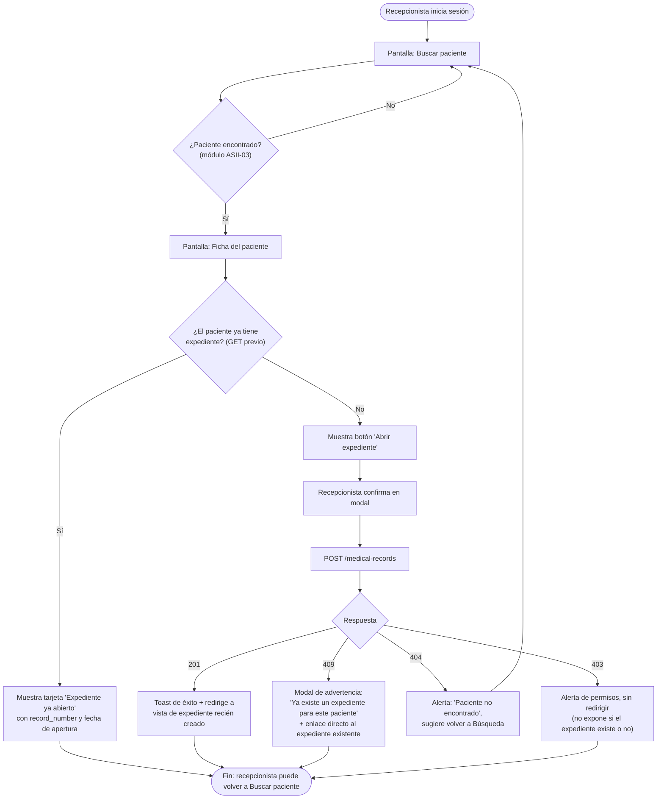
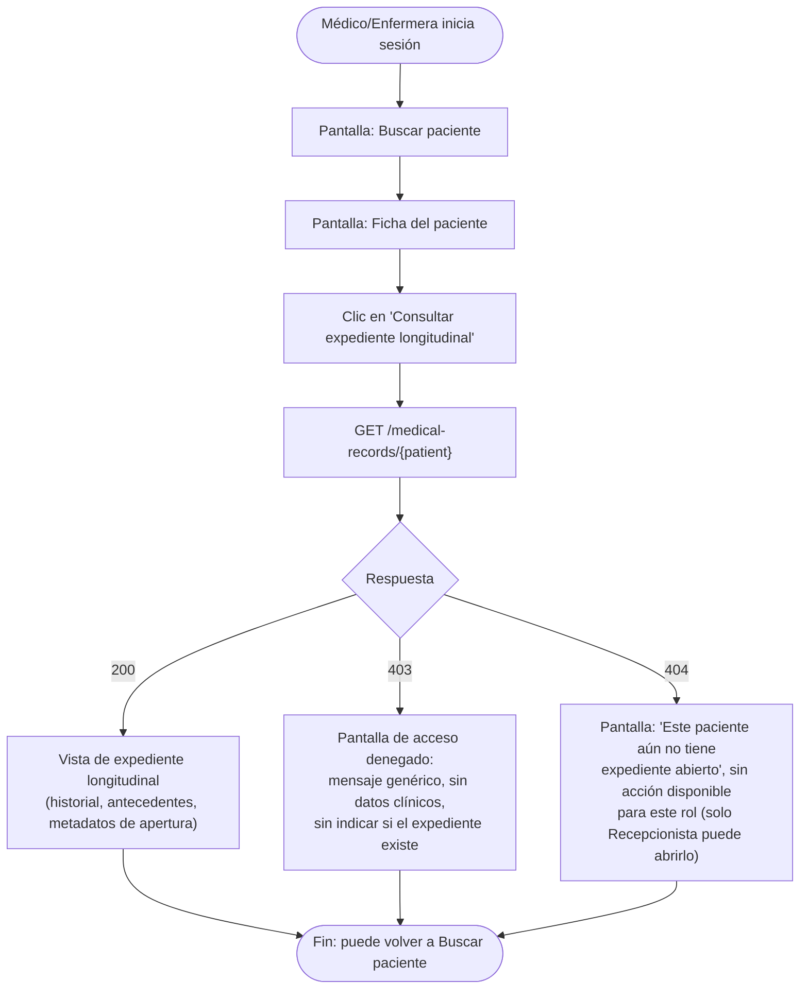

# ASII-10 — Expediente médico electrónico base
## Semana 8: flujo UX por rol

> **Entrega correspondiente a la Semana 8** del plan ASII (`README.md` raíz, tabla "Plan semanal ASII", fila 8): *"Flujo UX por rol"*, con evidencia *"User flow, wireframes iniciales y reglas de interacción"*.
>
> Como el frontend de ASII-10 todavía no está implementado (ver [Semana 7, sección 1](./semana-7-diseno-componentes-refactorizacion.md#1-diagrama-de-componentes-backend--frontend-propuesto)), esta entrega diseña el flujo de interacción de los dos roles que consumen el módulo — **Recepcionista** (abre el expediente) y **Médico/Enfermera** (lo consulta) —, tomando como base los códigos de respuesta ya fijados en el [contrato de la Semana 5](./semana-5-contrato-api-plan-integracion.md#1-contrato-de-la-api-consolidado).

## 1. User flow — Recepcionista (apertura de expediente)



## 2. User flow — Médico / Enfermera (consulta longitudinal)



## 3. Wireframes iniciales (baja fidelidad)

Wireframes en ASCII, consistentes con el resto de diagramas del repositorio (texto versionable en Git, sin binarios). Se detalla el layout y no el estilo visual — el estilo se define en la Semana 11 (mockup).

### 3.1. Ficha del paciente — vista Recepcionista (sin expediente)

```
┌─────────────────────────────────────────────────────┐
│ ← Volver a búsqueda           Paciente: Ana Pérez    │
├─────────────────────────────────────────────────────┤
│  Documento: 1234-56789-0101   Tenant: Hospital Norte │
│                                                       │
│  ⚠ Este paciente no tiene expediente médico abierto. │
│                                                       │
│  [  Abrir expediente médico  ]  <- botón primario    │
│  (solo visible para rol Recepcionista/Admin)         │
└─────────────────────────────────────────────────────┘
```

### 3.2. Modal de confirmación de apertura

```
┌──────────────────────────────────────────┐
│  Abrir expediente médico            [ x ] │
├──────────────────────────────────────────┤
│  Se creará el expediente longitudinal     │
│  para: Ana Pérez (doc. 1234-56789-0101).  │
│                                            │
│  Esta acción no se puede deshacer desde   │
│  la interfaz.                             │
│                                            │
│         [ Cancelar ]   [ Confirmar ]      │
└──────────────────────────────────────────┘
```

### 3.3. Ficha del paciente — vista Médico/Enfermera (con expediente)

```
┌─────────────────────────────────────────────────────┐
│ ← Volver a búsqueda           Paciente: Ana Pérez    │
├─────────────────────────────────────────────────────┤
│  Expediente: EXP-00042   Abierto: 12/03/2026         │
│                                                       │
│  [  Consultar expediente longitudinal  ]             │
│  (visible para rol Médico/Enfermera/Admin)           │
└─────────────────────────────────────────────────────┘
```

### 3.4. Vista de expediente longitudinal (200 OK)

```
┌─────────────────────────────────────────────────────┐
│ ← Volver a la ficha         Expediente EXP-00042     │
├─────────────────────────────────────────────────────┤
│ Paciente: Ana Pérez           Abierto por: Recep. X  │
│ Abierto: 12/03/2026                                  │
├─────────────────────────────────────────────────────┤
│ Antecedentes                                         │
│  ...contenido longitudinal (fuera de alcance ASII-10;│
│  poblado por módulos ASII-11/12/13/15 en el futuro)  │
├─────────────────────────────────────────────────────┤
│  ℹ Esta consulta ha quedado registrada en la         │
│    bitácora de auditoría (RF-10-06).                 │
└─────────────────────────────────────────────────────┘
```

### 3.5. Estado de error 403 (acceso denegado)

```
┌─────────────────────────────────────────────────────┐
│                    🔒                                │
│         No tiene autorización para consultar         │
│                  este expediente.                    │
│                                                       │
│         Si considera que es un error, contacte       │
│         al administrador de su hospital.             │
│                                                       │
│              [ Volver a búsqueda ]                   │
└─────────────────────────────────────────────────────┘
```

## 4. Reglas de interacción

| # | Regla | Origen (RF/RN) |
|---|---|---|
| RI-01 | El botón "Abrir expediente" solo se renderiza si el usuario en sesión tiene rol `Recepcionista` o `Admin`; nunca se oculta con CSS solamente — el backend igual rechaza con 403 (defensa en profundidad, ya validada en el backend). | RNF-10-02 |
| RI-02 | El botón "Consultar expediente longitudinal" solo se renderiza si el usuario tiene rol `Médico`, `Enfermera` o `Admin`. | RNF-10-02 |
| RI-03 | La apertura de expediente **siempre** pasa por un modal de confirmación (sección 3.2); no existe apertura de un solo clic, para evitar duplicados accidentales por doble clic. | RN-10-01 |
| RI-04 | Ante 409 (expediente duplicado), la interfaz nunca permite reintentar la apertura del mismo paciente: reemplaza el botón por un enlace directo al expediente existente. | RN-10-01, RF-10-03 |
| RI-05 | Ante 403, el mensaje es siempre genérico ("No tiene autorización...") y **no** distingue entre "no tiene permiso" y "el expediente no existe", para no filtrar información a un usuario no autorizado (mismo criterio que RNF-10-03 en el backend). | RNF-10-03, RNF-10-06 |
| RI-06 | Toda navegación hacia la vista de expediente longitudinal muestra el aviso de bitácora (sección 3.4) de forma visible, no oculto en un tooltip, para que el usuario sepa que la consulta queda auditada. | RF-10-06, RNF-10-04 |
| RI-07 | Los estados de carga (mientras se espera la respuesta de `POST`/`GET`) deshabilitan el botón de acción para evitar doble envío mientras la petición está en curso. | Consecuencia de RN-10-01 en la capa de interacción |

## 5. Trazabilidad con semanas anteriores

| Elemento previo | Elemento de esta entrega (Semana 8) |
|---|---|
| Actores y casos de uso UC-10-01/02/03 (Semana 1) | User flows de las secciones 1 y 2, uno por actor humano |
| Códigos de respuesta del contrato (Semana 5) | Cada rama de decisión de los user flows corresponde a un código (201/409/404/403 en apertura; 200/403/404 en consulta) |
| RNF-10-03/06 (mensajes que no filtran información), Semana 2 | Regla de interacción RI-05 |
| Componentes de frontend propuestos (Semana 7) | Los wireframes de la sección 3 corresponden a `PatientRecordSummaryCard.vue`, `OpenMedicalRecordModal.vue` y `MedicalRecordView.vue` |
