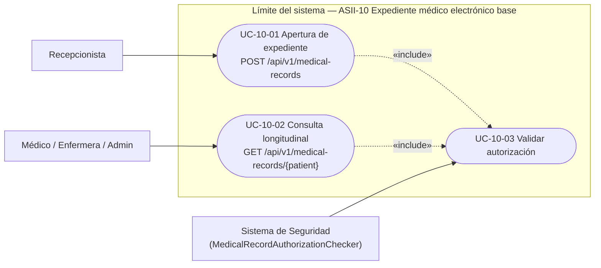

# 1. Diagrama de casos de uso — ASII-10

Deriva de `docs/module-10/semana-1-casos-de-uso.md`, sin cambios en actores ni casos de uso (siguen siendo
los tres validados en Semana 1); se agrega el límite explícito del sistema (recuadro) y se anota qué caso de
uso corresponde a qué endpoint real del contrato (ver `ESPECIFICACION.md`, sección 7).

**Narrativa (sin cambios respecto a Semana 1):** la recepcionista abre el expediente una sola vez por
paciente; el rol clínico autorizado lo consulta cuantas veces lo necesite; ambos casos de uso incluyen
obligatoriamente la validación de autorización.
