# 2. Diagrama de clases de diseño — ASII-10

Nombres reales del código de esta entrega (`app/Domain/MedicalRecord`, `app/Application/MedicalRecord`,
`app/Infrastructure/MedicalRecord`, `app/Http/Controllers/Api/V1/MedicalRecordController.php`).

```mermaid
classDiagram
    class MedicalRecordController {
        +open(OpenMedicalRecordRequest) JsonResponse
        +show(int patient) JsonResponse
    }

    class OpenMedicalRecordAction {
        -MedicalRecordRepository repository
        -PatientExistenceChecker patients
        -MedicalRecordAuthorizationChecker authorization
        -MedicalRecordAuditLogger auditLogger
        +handle(tenantId, patientId, context) MedicalRecordRecord
    }

    class ViewMedicalRecordAction {
        -MedicalRecordRepository repository
        -MedicalRecordAuthorizationChecker authorization
        -MedicalRecordAuditLogger auditLogger
        +handle(tenantId, patientId, context) MedicalRecordRecord
    }

    class MedicalRecordAuthorizationChecker {
        +authorizeOpen(AuthorizationContext) void
        +authorizeView(AuthorizationContext) void
    }

    class AuthorizationContext {
        +int userId
        +string[] roles
    }

    class MedicalRecordRecord {
        +int~null~ id
        +string tenantId
        +int patientId
        +string recordNumber
        +DateTimeImmutable openedAt
        +int~null~ openedBy
    }

    class MedicalRecordRepository {
        <<interface>>
        +existsForPatient(tenantId, patientId) bool
        +findByPatientId(tenantId, patientId) MedicalRecordRecord~null~
        +nextRecordNumber(tenantId) string
        +create(MedicalRecordRecord) MedicalRecordRecord
    }

    class MedicalRecordAuditLogger {
        <<interface>>
        +logOpen(tenantId, patientId, userId, result, reason) void
        +logView(tenantId, patientId, userId, result, reason) void
    }

    class PatientExistenceChecker {
        <<interface>>
        +exists(tenantId, patientId) bool
    }

    class EloquentMedicalRecordRepository {
        -MedicalRecord model
    }

    class InMemoryMedicalRecordRepository {
        -array records
    }

    class EloquentMedicalRecordAuditLogger
    class EloquentPatientExistenceChecker

    class MedicalRecordAlreadyExistsException
    class MedicalRecordAccessDeniedException
    class MedicalRecordNotFoundException
    class PatientNotFoundException

    MedicalRecordController --> OpenMedicalRecordAction
    MedicalRecordController --> ViewMedicalRecordAction
    OpenMedicalRecordAction --> MedicalRecordRepository
    OpenMedicalRecordAction --> PatientExistenceChecker
    OpenMedicalRecordAction --> MedicalRecordAuthorizationChecker
    OpenMedicalRecordAction --> MedicalRecordAuditLogger
    OpenMedicalRecordAction ..> MedicalRecordAlreadyExistsException
    OpenMedicalRecordAction ..> PatientNotFoundException
    ViewMedicalRecordAction --> MedicalRecordRepository
    ViewMedicalRecordAction --> MedicalRecordAuthorizationChecker
    ViewMedicalRecordAction --> MedicalRecordAuditLogger
    ViewMedicalRecordAction ..> MedicalRecordNotFoundException
    MedicalRecordAuthorizationChecker ..> MedicalRecordAccessDeniedException
    MedicalRecordAuthorizationChecker --> AuthorizationContext
    MedicalRecordRepository <|.. EloquentMedicalRecordRepository
    MedicalRecordRepository <|.. InMemoryMedicalRecordRepository
    MedicalRecordAuditLogger <|.. EloquentMedicalRecordAuditLogger
    PatientExistenceChecker <|.. EloquentPatientExistenceChecker
    MedicalRecordRepository ..> MedicalRecordRecord
```

**Nota de trazabilidad SRP** (ver `docs/module-10/semana-2-rf-rnf-solid.md`, sección 4): cada clase de esta
entrega corresponde exactamente a una fila de la tabla SOLID ya publicada — el controlador no ganó lógica de
negocio, `OpenMedicalRecordAction`/`ViewMedicalRecordAction` no ganaron lógica de autorización, y
`MedicalRecordAuthorizationChecker` no ganó lógica de persistencia.
