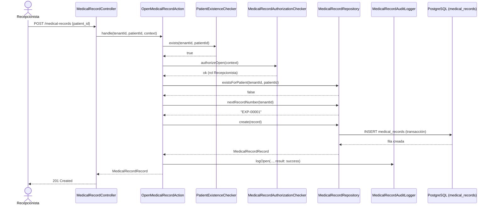
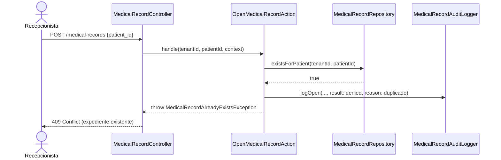
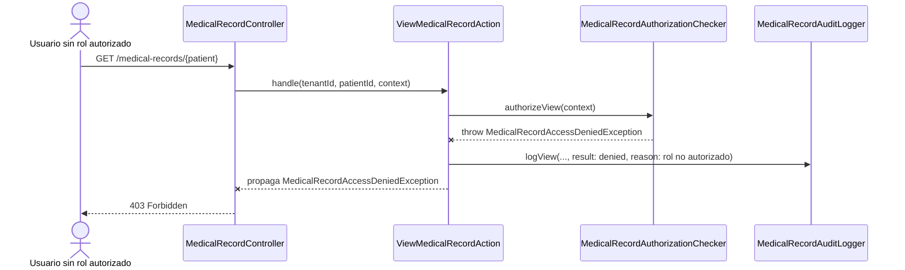

# 3. Diagrama de secuencia — ASII-10

## 3.1. Camino principal — apertura exitosa

```mermaid
sequenceDiagram
    actor Recepcionista
    participant Ctrl as MedicalRecordController
    participant Action as OpenMedicalRecordAction
    participant Patients as PatientExistenceChecker
    participant Auth as MedicalRecordAuthorizationChecker
    participant Repo as MedicalRecordRepository
    participant Audit as MedicalRecordAuditLogger
    participant DB as PostgreSQL (medical_records)

    Recepcionista->>Ctrl: POST /medical-records {patient_id}
    Ctrl->>Action: handle(tenantId, patientId, context)
    Action->>Patients: exists(tenantId, patientId)
    Patients-->>Action: true
    Action->>Auth: authorizeOpen(context)
    Auth-->>Action: ok (rol Recepcionista)
    Action->>Repo: existsForPatient(tenantId, patientId)
    Repo-->>Action: false
    Action->>Repo: nextRecordNumber(tenantId)
    Repo-->>Action: "EXP-00001"
    Action->>Repo: create(record)
    Repo->>DB: INSERT medical_records (transacción)
    DB-->>Repo: fila creada
    Repo-->>Action: MedicalRecordRecord
    Action->>Audit: logOpen(..., result: success)
    Action-->>Ctrl: MedicalRecordRecord
    Ctrl-->>Recepcionista: 201 Created
```

## 3.2. Excepción — expediente duplicado

```mermaid
sequenceDiagram
    actor Recepcionista
    participant Ctrl as MedicalRecordController
    participant Action as OpenMedicalRecordAction
    participant Repo as MedicalRecordRepository
    participant Audit as MedicalRecordAuditLogger

    Recepcionista->>Ctrl: POST /medical-records {patient_id}
    Ctrl->>Action: handle(tenantId, patientId, context)
    Action->>Repo: existsForPatient(tenantId, patientId)
    Repo-->>Action: true
    Action->>Audit: logOpen(..., result: denied, reason: duplicado)
    Action--xCtrl: throw MedicalRecordAlreadyExistsException
    Ctrl-->>Recepcionista: 409 Conflict (expediente existente)
```

## 3.3. Excepción — acceso denegado en la consulta

```mermaid
sequenceDiagram
    actor Usuario as Usuario sin rol autorizado
    participant Ctrl as MedicalRecordController
    participant Action as ViewMedicalRecordAction
    participant Auth as MedicalRecordAuthorizationChecker
    participant Audit as MedicalRecordAuditLogger

    Usuario->>Ctrl: GET /medical-records/{patient}
    Ctrl->>Action: handle(tenantId, patientId, context)
    Action->>Auth: authorizeView(context)
    Auth--xAction: throw MedicalRecordAccessDeniedException
    Action->>Audit: logView(..., result: denied, reason: rol no autorizado)
    Action--xCtrl: propaga MedicalRecordAccessDeniedException
    Ctrl-->>Usuario: 403 Forbidden
```
