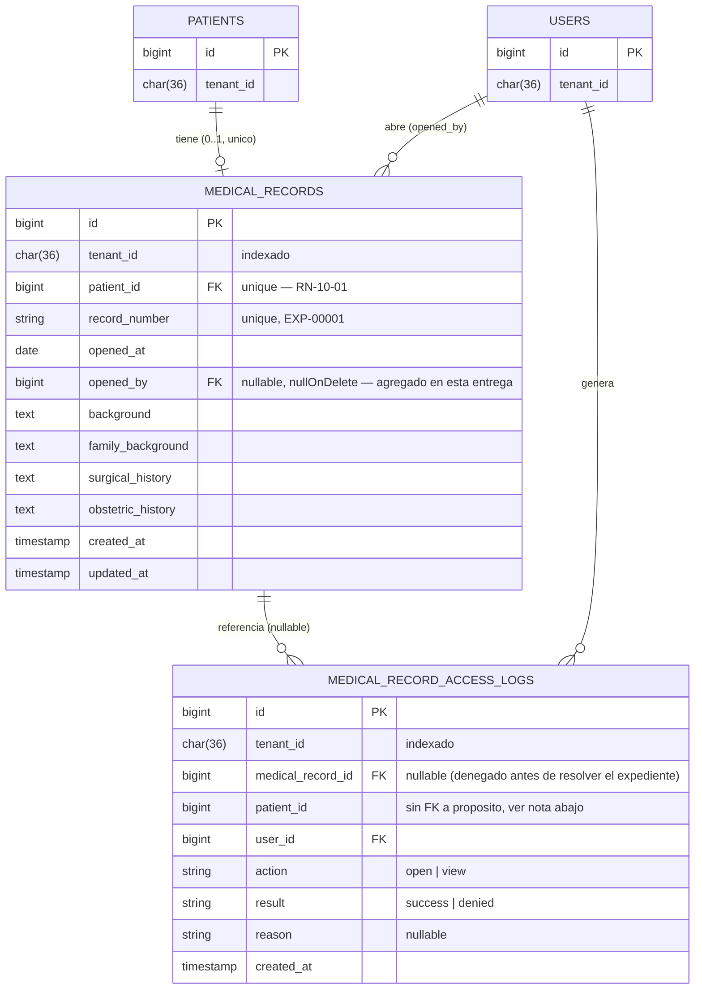

# 5. Vista de datos — ASII-10

Fragmento entidad-relación de lo que este módulo posee o extiende (HOSPITAL). `medical_records` ya existe
(migración de otro módulo); esta entrega solo **agrega** la columna `opened_by` y la tabla nueva
`medical_record_access_logs` (ver `ADR-001-arquitectura.md`, sección 5, y las migraciones en
`database/migrations/`).

## Índices y restricciones relevantes

| Tabla | Índice/restricción | Motivo |
|---|---|---|
| `medical_records` | `unique(patient_id)` (ya existente) | Garantiza RN-10-01 a nivel de motor, no solo en aplicación |
| `medical_records` | `opened_by` FK `nullOnDelete` | Si el usuario que abrió el expediente se elimina, el expediente no se borra (integridad del historial) |
| `medical_record_access_logs` | `index(tenant_id, patient_id, created_at)` | Consulta habitual: bitácora de un paciente ordenada por fecha |
| `medical_record_access_logs` | `index(tenant_id, action, result)` | Consulta habitual: cuántos intentos denegados por tipo de operación |
| `medical_record_access_logs` | `patient_id` **sin** FK a `patients` (a propósito) | La bitácora también debe poder registrar un intento denegado por rol o por autorización antes de confirmar que el paciente existe (RN-10-02: "toda apertura o consulta se registra", incluida la que apunta a un `patient_id` inválido). Una FK obligatoria rompería ese registro. |
